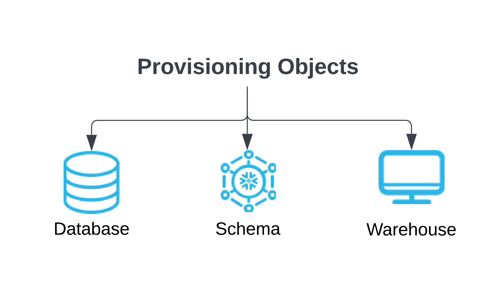
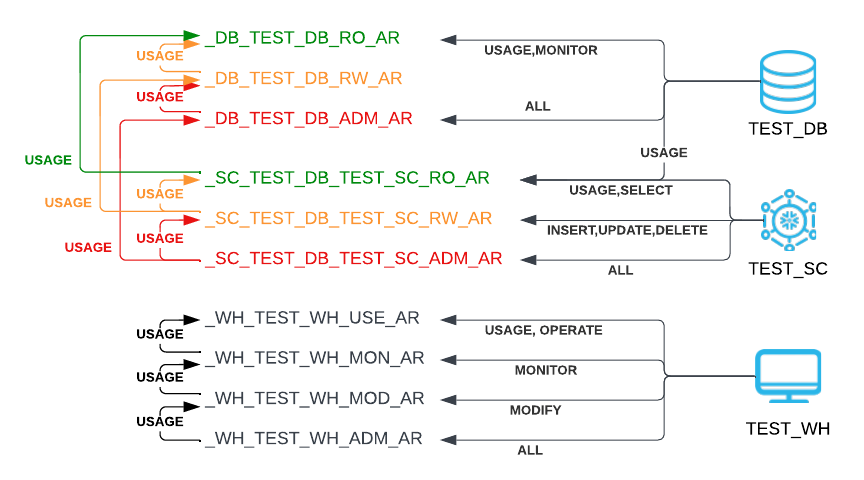

# snowflake-provisioning

Snowflake Database, Schema, and Warehouse provisioning

## Table of Contents

1. [Overview](#overview)
   1. [Functional and Access roles](#functional-and-access-roles)
   1. [Creating a Functional role](#creating-a-functional-role)
1. [Configuration](#configuration)
1. [Executing](#executing)
   1. [Creating and Dropping Warehouses](#creating-and-dropping-warehouses)
1. [Automating](#automating_functional_roles)
1. [TODO](#todo)
1. [Author](#author)
1. [Credits](#credits)
1. [License](#license)

## Overview

This repository contains a Python-based Snowflake Database/Schema/Warehouse Provisioning script, that provides a
framework for deploying objects with configurable and customizable access roles.

Snowflake supports a highly granular and configurable RBAC[^1] (Role-Based Access Control) scheme.
The posibilities of configuration are endless and it is almost too complex to understand when you are new to Snowflake.
`sf_create_obj` aims to provide an example of an implementation that can be easily extended while showing all sql
commands used to build out the framework with. This also allows for easy integration with
[schemachange](https://github.com/Snowflake-Labs/schemachange)/
[Snowchange](https://jeremiahhansen.medium.com/snowchange-a-database-change-management-tool-b9f0b786a7da) as both deploy
and rollback output is provided.

### Functional and Access roles

Best practice as recommended by Snowflake is to separate functional access from the underlying object access, i.e.,
database, schema, individual tables, etc.

Functional access can be defined as a role that a script or user needs to perform and operation across many schemas or
databases. In the examples provided all functional roles have a postfix of \_FR in the role name. 

Access roles govern access to a privilege on an object. An example is an access role that provides write access to all
tables in a schema. Access roles often are nested and a role at a database level can provide access to all underlying
schemas. That means rather than explicitly granting a privilege it can be inherited from another role. A common
convention that is followed here is to use a postfix of \_AR to signify an access role. 

Using \_AR and \_FR to provide clear separation between roles makes it easier to quickly see the difference when looking
at the roles in Snowflake. Taking this one step further to simplify how your roles are shown in both Snowflake's
Classic UI as well as Snowsight this framework allows you to prefix access roles with a custom name which includes an
underscore (\_). This puts the access roles at the end of the role list and helps avoid users using access roles
directly. Having a customizable prefix also allows us to think ahead to the automation of functional roles. In the
sample configuration database access roles are prefixed by \_DB\_, schema access roles with \_SC\_, and warehouses
with \_WH\_ respectively. 

Inheritance between database and schema access roles is setup based on configurable parameters and is managed
automatically between database and schemas as a simplified illustration below shows:



While the illustration might look complex at first it accomplishes quite a few things. For the database 3 different
roles are created and a hierarchy is formed from the lowest access role to the highest access role. In the example
the read-only (RO) role can only use and monitor the database TEST_DB; the read-write (RW) role doesn't have any
explicit privileges; and the admin (ADM) role is granted all privileges on the database. The role hierarchy is
created so that the RW role doesn't have to be granted explicit permission to use and monitor, but it inherits this
from the RO role.

Where that becomes more powerful is with the privileges granted at the schema level - the RO role at the schema level
is granted select on all (and future) tables in the schema. This privilege is in turn granted to the RO role at the
database level through role inheritance. The RW role is granted insert, update, and delete on all (and future) tables
in the schema and with the role inheritance the RW role at the database now has more functionality. This is why both
database and schema role hierarchy for this tool need to be in sync. 

The warehouse object is completely independent from databases and schemas so the naming convention and role hierarchy
can be different there as well. In the example here we have chosen to use 4 different types of access roles that each
represent privileges you may want to separate out. 

### Creating a Functional role

Putting these individual access roles together to form a simple functional role shows how powerful the role hierarchy
in Snowflake is: 
```SQL
CREATE ROLE IF NOT EXISTS TEST_READER_FR;
GRANT ROLE _SC_TEST_DB_TEST_SC_RO_AR TO ROLE TEST_READER_FR;
GRANT ROLE _WH_TEST_WH_USE_AR        TO ROLE TEST_READER_FR;
```
Leading to the following role hierarchy:

The TEST\_READER\_FR functional role is granted two explicit roles that give it access to use and operate the
warehouse TEST\_WH, use the database TEST\_DB, use the schema TEST\_SC, as well as select from all tables in the
TEST\_SC schema. 

With this flexibility it is possible to manage just a few functional roles that provides the exact access you want
across hundreds of databases and schemas through simple automation.

This documentation doesn't aim to spell out a specific architectural strategy on how to separate environments in a
single Snowflake account, but gives you the flexibility to solve that yourself through your own naming convention.
An example is embedding PROD/TEST/DEV in your database name either as a prefix or embedded in the name. 

## Configuration

Each of the 3 types of objects that can be provisioned with this script need their own json-formatted configuration
file ([db-config.json](db-config.json), [sc-config.json](sc-config.json), [wh-config.json](wh-config.json)). 

The default [configuration](wh-config.json) for a warehouse is provided below:

```JSON
{
	"TYPE"              : "WAREHOUSE",
	"ROLE_OWNER"        : "SYSADMIN",
	"ROLE_HIERARCHY"    : [ "ADM", "MOD", "MON", "USE" ],
        "ROLE_PERMISSIONS"  : {
	                        "ADM" : { "ALL"            : [ "WAREHOUSE" ] },
	                        "MOD" : { "MODIFY"         : [ "WAREHOUSE" ] },
    	                        "MON" : { "MONITOR"        : [ "WAREHOUSE" ] },
	                        "USE" : { "USAGE, OPERATE" : [ "WAREHOUSE" ] }
   	},
        "DEFAULT_WH_PARAMS" : {
            "MAX_CLUSTER_COUNT"                   : 1,
            "MIN_CLUSTER_COUNT"                   : 1,
            "AUTO_SUSPEND"                        : 60,
            "AUTO_RESUME"                         : "True",
            "INITIALLY_SUSPENDED"                 : "True",
            "SCALING_POLICY"                      : "STANDARD",
            "COMMENT"                             : "sf_create_obj created warehouse",
            "STATEMENT_QUEUED_TIMEOUT_IN_SECONDS" : 1800,
            "STATEMENT_TIMEOUT_IN_SECONDS"        : 3600
	},
        "AR_PREFIX"         : "_WH_"
}
```
As described earlier the configuration of the provisioning tool allows you to create multiple different types of access roles. If you want to customize a special role that allows it to execute stored procedures and tasks, but not directly write to tables that is possible as long as you can specify it in Snowflake grant terms. 

## Executing

Embedded help is provided with the scripts:

```
$ ./sf_create_obj --help
usage: sf_create_obj [-h] {database,schema,warehouse} ...

Snowflake database, schema, and warehouse provisioning

positional arguments:
  {database,schema,warehouse}
                        sub-command help
    database            Provision database in Snowflake
    schema              Provision schema in Snowflake
    warehouse           Provision warehouse in Snowflake

optional arguments:
  -h, --help            show this help message and exit
```

Each object has its own options reflecting all the parameters for the given snowflake object. An example is the embedded help for creating a database:

```
$ ./sf_create_obj database --help
usage: sf_create_obj database [-h] [--data_retention_time_in_days DATA_RETENTION_TIME_IN_DAYS] [--max_data_extension_time_in_days MAX_DATA_EXTENSION_TIME_IN_DAYS] [--transient]
                              [--default_ddl_collation DEFAULT_DDL_COLLATION] [--comment COMMENT] [--tag TAG]
                              name

positional arguments:
  name                  Name of Snowflake object to provision

optional arguments:
  -h, --help            show this help message and exit
  --data_retention_time_in_days DATA_RETENTION_TIME_IN_DAYS
                        Time Travel in days 1 for standard edition 1-90 for higher editions
  --max_data_extension_time_in_days MAX_DATA_EXTENSION_TIME_IN_DAYS
                        Maximum number of days Snowflake can extend data retention period 1-90
  --transient           Applies to database and schema, creates transient object
  --default_ddl_collation DEFAULT_DDL_COLLATION
                        Default DDL Collation
  --comment COMMENT     Comment to add to object
  --tag TAG             Add a single tag_name=value to object
```

By default the script prints the DDL to STDOUT. This is to allow for pushing the create/drop (rollback) output into a snowchange/schemachange pipeline for execution. 

### Creating and Dropping Warehouses

The simplest way to show how a sample warehouse could be provisioned is to run it with the [default configuration](wh-config.json) and simply provide a name:

```
$ ./sf_create_obj warehouse TEST_WH
CREATE WAREHOUSE IF NOT EXISTS TEST_WH
  AUTO_RESUME                         = TRUE
  AUTO_SUSPEND                        = 60
  COMMENT                             = 'sf_create_obj created warehouse'
  INITIALLY_SUSPENDED                 = TRUE
  MAX_CLUSTER_COUNT                   = 1
  MIN_CLUSTER_COUNT                   = 1
  SCALING_POLICY                      = STANDARD
  STATEMENT_QUEUED_TIMEOUT_IN_SECONDS = 1800
  STATEMENT_TIMEOUT_IN_SECONDS        = 3600
;
CREATE ROLE IF NOT EXISTS TEST_WH_USE_AR;
CREATE ROLE IF NOT EXISTS TEST_WH_MON_AR;
CREATE ROLE IF NOT EXISTS TEST_WH_MOD_AR;
CREATE ROLE IF NOT EXISTS TEST_WH_ADM_AR;

GRANT OWNERSHIP ON WAREHOUSE TEST_WH TO ROLE SYSADMIN REVOKE CURRENT GRANTS;
GRANT ALL PRIVILEGES ON WAREHOUSE TEST_WH TO ROLE SYSADMIN;
GRANT OWNERSHIP ON ROLE TEST_WH_USE_AR TO ROLE SYSADMIN REVOKE CURRENT GRANTS;
GRANT OWNERSHIP ON ROLE TEST_WH_MON_AR TO ROLE SYSADMIN REVOKE CURRENT GRANTS;
GRANT OWNERSHIP ON ROLE TEST_WH_MOD_AR TO ROLE SYSADMIN REVOKE CURRENT GRANTS;
GRANT OWNERSHIP ON ROLE TEST_WH_ADM_AR TO ROLE SYSADMIN REVOKE CURRENT GRANTS;

GRANT ROLE TEST_WH_USE_AR TO ROLE TEST_WH_MON_AR;
GRANT ROLE TEST_WH_MON_AR TO ROLE TEST_WH_MOD_AR;
GRANT ROLE TEST_WH_MOD_AR TO ROLE TEST_WH_ADM_AR;
GRANT ROLE TEST_WH_ADM_AR TO ROLE SYSADMIN;

GRANT USAGE, OPERATE ON WAREHOUSE TEST_WH TO ROLE TEST_WH_USE_AR;
GRANT MONITOR ON WAREHOUSE TEST_WH TO ROLE TEST_WH_MON_AR;
GRANT MODIFY ON WAREHOUSE TEST_WH TO ROLE TEST_WH_MOD_AR;
GRANT ALL ON WAREHOUSE TEST_WH TO ROLE TEST_WH_ADM_AR;
```
With an easy way to drop the warehouse, roles, and associated grants:
```
$ ./sf_drop_obj warehouse TEST_WH
REVOKE ALL ON WAREHOUSE TEST_WH FROM ROLE TEST_WH_ADM_AR;
REVOKE MODIFY ON WAREHOUSE TEST_WH FROM ROLE TEST_WH_MOD_AR;
REVOKE MONITOR ON WAREHOUSE TEST_WH FROM ROLE TEST_WH_MON_AR;
REVOKE USAGE, OPERATE ON WAREHOUSE TEST_WH FROM ROLE TEST_WH_USE_AR;

REVOKE ROLE TEST_WH_ADM_AR FROM ROLE SYSADMIN;
REVOKE ROLE TEST_WH_MOD_AR FROM ROLE TEST_WH_ADM_AR;
REVOKE ROLE TEST_WH_MON_AR FROM ROLE TEST_WH_MOD_AR;
REVOKE ROLE TEST_WH_USE_AR FROM ROLE TEST_WH_MON_AR;

DROP ROLE IF EXISTS TEST_WH_ADM_AR;
DROP ROLE IF EXISTS TEST_WH_MOD_AR;
DROP ROLE IF EXISTS TEST_WH_MON_AR;
DROP ROLE IF EXISTS TEST_WH_USE_AR;
DROP WAREHOUSE IF EXISTS TEST_WH;
```


The object name is validated against the allowed object names in Snowflake. 

## Automating Functional Roles

Building an automatic tool to provision and maintain functional roles is straight forward when you consistently deploy database and schema objects with the appropriate access roles.

```
-- Checking which access roles have been granted to a functional role:
SHOW GRANTS ON TEST_READER_FR;
-- Finding possible access roles for a given DATABASE:
SHOW FUTURE GRANTS IN DATABASE;
SHOW FUTURE GRANTS IN DATABASE.SCHEMA;
```
If your provisioning of objects is entirely governed by a the consistent naming convention `sf_create_obj` provides you can make it even simpler based on the available access roles in the account:

```
show roles like '_%_AR'
parse output
for each role you care about:
  show grants to role
  add/remove grants needed

```


## TODO 

- [ ] Simplifying code to allow for a single role at each object level [sfprovisioning.py](sfprovisioning.py)/create\_%\_r2r\_grants
- [ ] Currently does not support "GRANT ALL ON ALL PIPES IN SCHEMA", tags, search optimizations.
- [ ] Currently does not support quoted object names in Snowflake.

## Author

Thomas Eibner (@thomaseibner) [twitter](http://twitter.com/thomaseibner) [LinkedIn](https://www.linkedin.com/in/thomaseibner/)

## Credits

Scott Redding @ Snowflake for great conversations on the topic and always being willing to hear out ideas.

Ryan Wieber @ Snowflake likewise for entertaining my questions and having a lot of patience. 

## License

Licensed under the Apache License, Version 2.0 (the "License"); you may not use this tool except in compliance with the License. You may obtain a copy of the License at: http://www.apache.org/licenses/LICENSE-2.0

Unless required by applicable law or agreed to in writing, software distributed under the License is distributed on an "AS IS" BASIS, WITHOUT WARRANTIES OR CONDITIONS OF ANY KIND, either express or implied. See the License for the specific language governing permissions and limitations under the License.


[^1]: https://docs.snowflake.com/en/user-guide/security-access-control-overview.html
